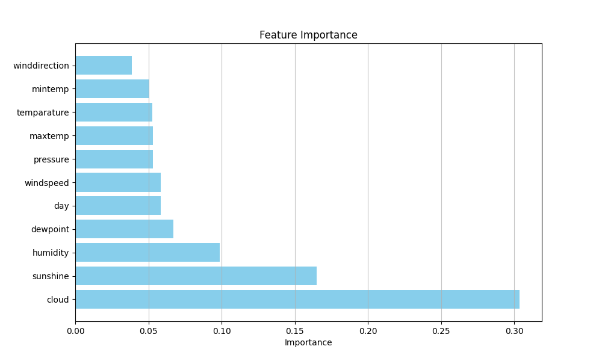

# Binary Rainfall Prediction Project

## Overview
This project implements machine learning models to predict rainfall with a binary prediction. The goal is to accurately classify whether rainfall will occur (1) or not (0) based on various weather features. This is a simple competition hosted by Kaggle through Walter Reade and Elizabeth Park.

[Binary Prediction Kaggle Link](https://www.kaggle.com/competitions/playground-series-s5e3/overview)

## Models Implemented
- K-Nearest Neighbors (KNN) Ensemble
- Voting Classifier combining multiple models
- Feature importance analysis

## Key Features
- Data preprocessing and standardization
- Cross-validation for model evaluation
- Hyperparameter tuning using GridSearchCV
- Ensemble methods for improved prediction accuracy
- Feature importance visualization
- Probability-based predictions

